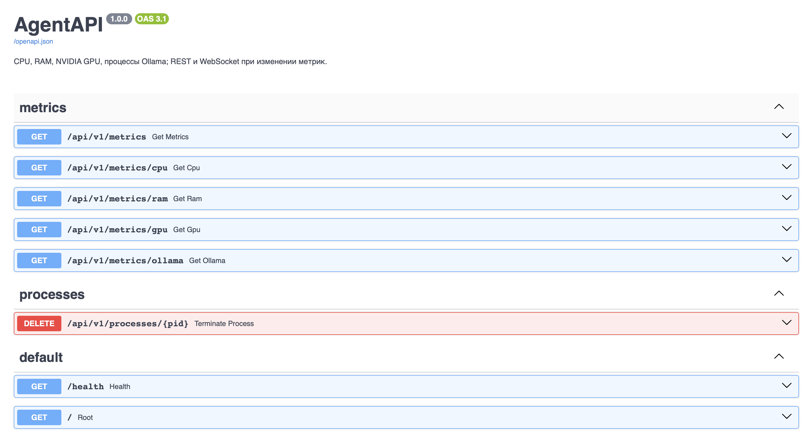
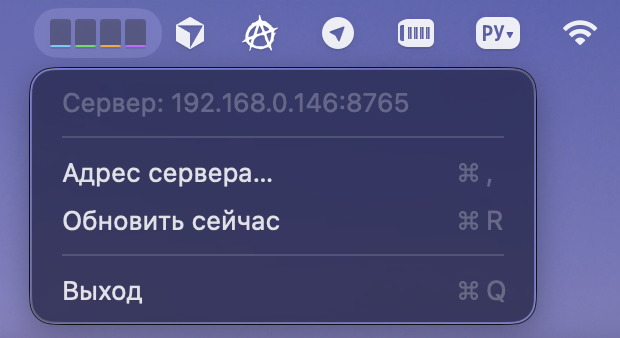

# AgentAPI

Набор для **мониторинга машины с агентами** (в т.ч. Ollama): HTTP/WebSocket API метрик и **macOS-клиент в меню-баре** с мини-графиком нагрузки.

| Компонент | Описание |
|-----------|----------|
| [**Server**](Server/README.md) | FastAPI: CPU, RAM, NVIDIA GPU, процессы Ollama; REST и WebSocket |
| [**ClientMacOS**](ClientMacOS/README.md) | Нативное приложение для macOS: иконка в трее, столбики по метрикам |

---

## Скриншоты

**Сервер** (`/docs`, терминал с uvicorn и т.п.)

**Клиент macOS** (иконка в строке меню с мини-столбиками)

---

## Быстрый старт

1. Поднимите сервер: см. [Server/README.md](Server/README.md).
2. Установите клиент (опционально): см. [ClientMacOS/README.md](ClientMacOS/README.md).
3. В клиенте укажите базовый URL сервера (например `http://IP:8765`), если это не локальная машина.

По умолчанию сервер слушает порт **8765** (`AGENT_API_PORT`).
